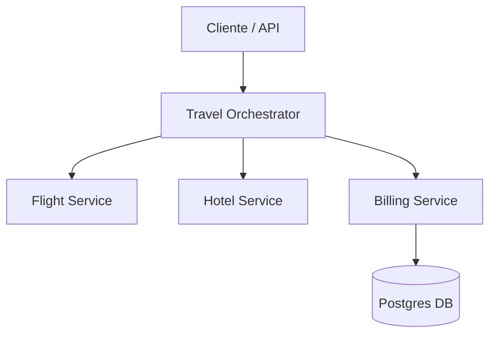

# Spring Boot + SAGA Pattern: Travel Agency Lab

## Escenario

Este proyecto simula un sistema de reserva de viajes en una arquitectura de microservicios. Para garantizar la consistencia de los datos entre múltiples servicios (Vuelos, Hoteles, Facturación) sin usar transacciones distribuidas pesadas, implementamos el **Patrón SAGA** mediante un orquestador.

## 🎓 Laboratorio: Patrón SAGA y Pruebas de Integración

### Objetivos de Aprendizaje

* Comprender y aplicar el patrón SAGA basado en orquestación.
* Implementar transacciones de compensación para mantener la consistencia eventual.
* Utilizar `MockRestServiceServer` para pruebas de integración de clientes REST.
* Integrar bases de datos reales en las pruebas usando **Testcontainers**.

### Tabla de Ejercicios

| # | Ejercicio | Archivo de Test | Documentación |
| :--- | :--- | :--- | :--- |
| 1 | Camino Feliz del Orquestador | [TravelOrchestratorHappyPathTest.java](file:///Users/anyulled/IdeaProjects/java-avanzado-lab-sagas-1/travel-agency/src/test/java/com/example/travelagency/TravelOrchestratorHappyPathTest.java) | [Guía 1](file:///Users/anyulled/IdeaProjects/java-avanzado-lab-sagas-1/docs/ejercicio-1-happy-path.md) |
| 2 | Transacciones de Compensación | [TravelOrchestratorCompensationTest.java](file:///Users/anyulled/IdeaProjects/java-avanzado-lab-sagas-1/travel-agency/src/test/java/com/example/travelagency/TravelOrchestratorCompensationTest.java) | [Guía 2](file:///Users/anyulled/IdeaProjects/java-avanzado-lab-sagas-1/docs/ejercicio-2-compensacion.md) |
| 3 | Persistencia con Testcontainers | [BillingPersistenceTest.java](file:///Users/anyulled/IdeaProjects/java-avanzado-lab-sagas-1/billing-service/src/test/java/com/example/billingservice/BillingPersistenceTest.java) | [Guía 3](file:///Users/anyulled/IdeaProjects/java-avanzado-lab-sagas-1/docs/ejercicio-3-postgres.md) |

### Flujo de Trabajo

1. Lee la documentación del ejercicio en la carpeta `docs/`.
2. Abre el archivo de test correspondiente.
3. Completa los comentarios `// TODO:` siguiendo las instrucciones.
4. Ejecuta el comando de verificación indicado en la guía.

### Arquitectura del Sistema



### Tech Stack

* **Java 21**
* **Spring Boot 3.5.5**
* **Spring Cloud OpenFeign**
* **Spring Data JPA**
* **PostgreSQL**
* **Testcontainers**
* **Docker / Docker Compose**

### Estructura del Proyecto

```text
.
├── billing-service/      # Servicio de facturación (Persistencia Postgres)
├── flight-service/       # Servicio de vuelos
├── hotel-service/        # Servicio de hoteles
├── travel-agency/        # Orquestador SAGA (Contiene los ejercicios principales)
├── docs/                 # Guías de los ejercicios
└── docker-compose.yml    # Infraestructura para pruebas manuales
```

### Cómo Ejecutar

#### Prerrequisitos

* JDK 21+
* Docker Desktop (para Testcontainers y Postgres)
* Maven 3.9+

#### Comandos Útiles

* **Compilar todo:** `mvn clean install -DskipTests`
* **Lanzar infraestructura:** `docker-compose up -d`
* **Ejecutar todos los tests:** `mvn test`

### Resolución de Problemas

| Error Común | Solución |
| :--- | :--- |
| Docker is not running | Asegúrate de que Docker Desktop esté iniciado para los ejercicios de Testcontainers. |
| Port 5432 already in use | Detén cualquier instancia local de Postgres o cambia el puerto en `docker-compose.yml`. |
| Compilation error | Verifica que todos los imports indicados en las guías estén presentes. |
